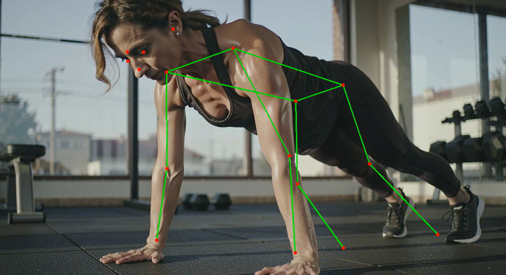
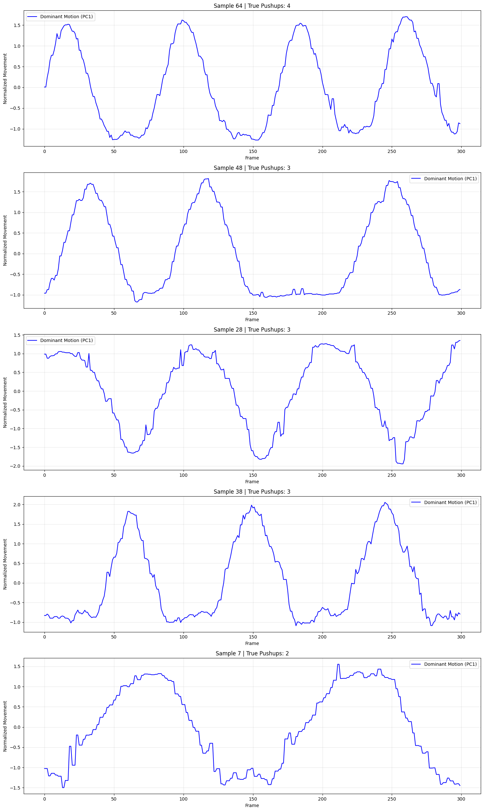
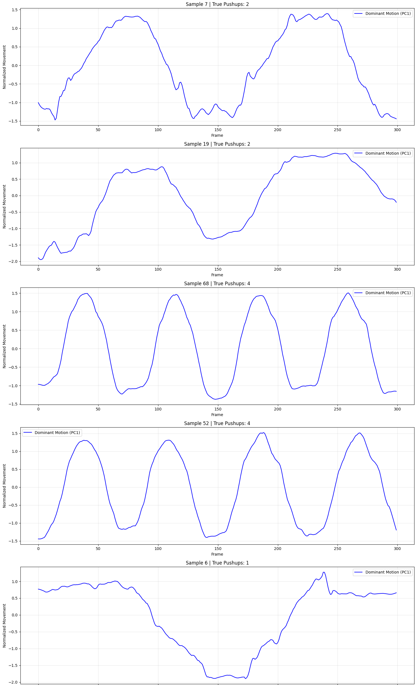
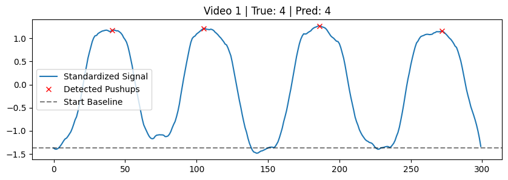
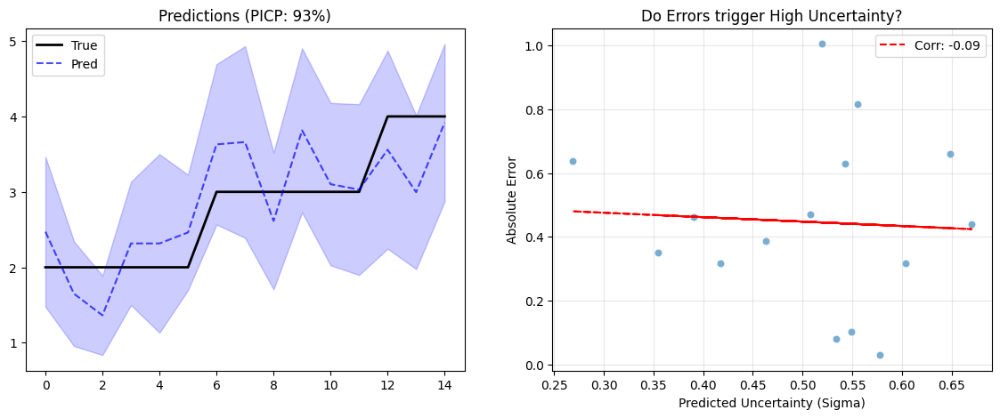
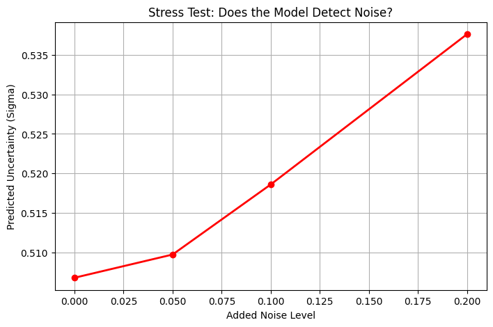
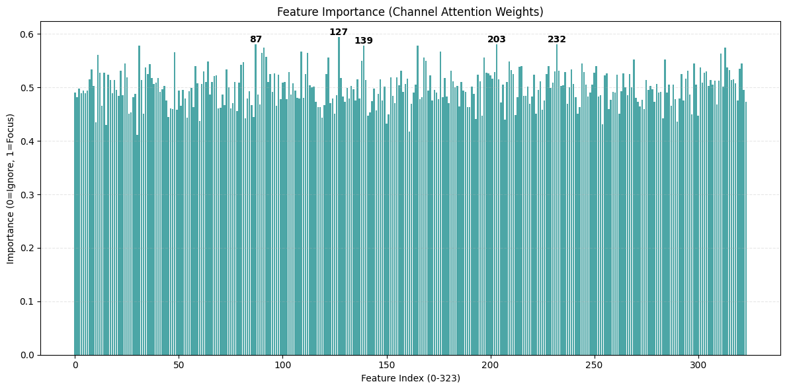

# Human Action Analysis: signal processing to Probabilistic Deep Learning

**Extreme dimensionality reduction and uncertainty quantification in deep learning in unconstrained video, including expert-guided learning and Confidence Calibration.**

---

  

## 1. Executive Summary
Capturing human movements in high-quality video requires the reduction of ultra high-dimensional spatiotemporal data into simple labels. In high-resolution video data of humans doing push ups, I ask, what is the simplest model that can extract the number of repetitions? Two, when a Deep Neural Network learns this representation, can it meaningfully quantify the uncertainty about its predictions? First, I use a scientific approach (**Learned Representation Extraction**, variance analysis, and **noise reduction**) to convert this challenge into a low-dimensional signal processing problem (and solve it with high accuracy of 80-90%). Then, I teach a **Convolutional Neural Network** to output a probability distribution of its predictions and investigate the quality of uncertainty estimates (Teacher-Learner signal, Confidence Calibration) in line with crucial questions in the AI literature (REF). By optimizing for the **Gaussian Negative Log Likelihood (NLL)**: the model learns to predict both the **movement repetitions** and meaningful **aleatoric uncertainty**, implying the variance of the learned probability distribution matches the prediction error.

**Key Results:**

* **Confidence Calibration:** Achieved **>90% Prediction Interval Coverage Probability (PICP)**, meaning the true answer always falls within the model's predicted confidence.
* **Precision:** Maintained an ultra-tight Mean Prediction Interval Width (MPIW) of **$\pm 1.1$ reps**.
* **Self-Awareness validation:** Validated via adversarial stress testing; the model correctly identifies noisy inputs by spiking its uncertainty metric (correlation > 0.9 under stress).
* **Accuracy:** Achieved **>90% Accuracy** and reduced training time to **0ms** by reducing the problem to signal processing through scientific investigation and use of existing models.

---

## 2. Data Challenge: Unconstrained Geometry to 1D data

### Summary
Before applying Deep Learning, a strong heuristic baseline was established:
1.  **Pose Estimation:** Extract 34 keypoints (YOLOv8-Pose).
2.  **Dimensionality Reduction:** Apply PCA to extract the 1st Principal Component (dominant motion).
3.  **Smoothing:** Savitzky-Golay filter to remove high-frequency jitter.
4.  **Orientation Normalization:** Automatically detect "up" vs "down" phase to standardize waveform direction.
5.  **Peak Counting:** Standard signal processing to count local maxima.

**Result:** >80% Accuracy.

### Data
Total Videos: 78
1. **Time**
   Min Duration: 2.74 s
   Max Duration: 13.56 s 
   Frame Rates:  23.23 to 59.43 FPS

2. **Resolution & Channels**
   Channels:     3 (RGB)
   Min Resolution: 1280x720 (921,600 pixels)
   Max Resolution: 1920x1080 (2,073,600 pixels) 

3. **Volume**
    Uncompressed Vol: 75.05 GB

### Learned Representations: pose estimation
The video data has staggering dimensionality of up to 2,021,760,000 values per video across channels x resolution x time, with the latter two being highly variable across videos. Moreover, the data shows humans performing push up motions from different angles in different backgrounds, providing little to no overlapping information in RGB channels. Common sense tells us that this problem can be reduced to detecting large movements within videos. 

I discovered the YOLO11 pose estimation model (https://docs.ultralytics.com/tasks/pose/) that can estimate human body joints in videos. Using this model, the spatial dimensions can be reduced from millions to just 17 pairs of absolute x and y coordinates. How do we extract information from this data?

  

### Pairwise Distance Matrix: from joint coordinates to information

Despite the camera position being still and constant, human movement is not defined by joint locations but how joints move relative to each other. To make the prediction model more robust to Out-of-Distribution data, general movement can be captured by computing the relative differences between joints across time (i.e. the distance between arm and head key points increases greatly from frame to frame during a push-up, but not during pose) in a 17 by 17 distance matrix. These 289 features are added to the absolute coordinates to create a Movement Matrix of 324 features across time. But, many key points are irrelevant (head motion), and noise exists in the pose estimation as well as the movements. How do we extract informative features?

### Two birds in one stone: Principal Axis of Movement
Raw pose estimation data is noisy. A keypoint might jump 10 pixels between frames due to estimation jitter, and users may film from the front, side, or top. Luckily, the relationship between movement and repetitions is simple. To capture large amounts of variance from repetitive movements into lower dimensional space while denoising, we can process the Movement Matrix with Principal Component Analysis. Can we capture the main axis of variance that is visible in push up repetitions? One large challenge is the different camera angles. How key points interact will be different depending on the video. What do we see if we visualize the first principal component of each video separately?

  

**The Insight:**
While raw coordinates ($x, y, z$) are chaotic, the **dominant axis of variance** in the data almost always corresponds to the repetition cycle. By extracting this axis using Principal Component Analysis (PCA) per video, we can simplify complex 3D motion into a clean 1D wave: the Axis of Movement (AoM).

Crucially, we see a clear relationship between the true number of push up repetitions and peaks and troths. Problematically, either peaks OR troths represent the downward position (correct amount of push ups) and the other one represents the pause inbetween (and is always off by one). The reason is obvious: PCA picks an arbitrary direction and its eigenvectors can be negative or positive just the same. If we compute the peaks and troths relative to the baseline, we can decide dynamically whether to use peaks or troths to count repetitions. The data looks a noisy across time, so we also apply temporal smoothing by fitting a third-degree polynomial Savgol filter. 

*What was first a billion-dimensional learning problem is now a one-dimensional peak counting task on time series data.*

  

### Signal processing predictions

We substituted a learning model with a science and physics informed pipeline, and without need for a training set we apply it to all video data with an accuracy of 93.33% with a Mean Squared Error of 0.0667.

Example image of counting peaks:
 

  

## 3. Uncertainty Estimation in Deep Learning
Prediction accuracy is important but uncertainty is a necessary component of predictive models, despite being a large challenge for deep learning architectures. I will investigate in the next chapter whether a Deep Learning Model (Probabilistic Convolutional Network) can be trained to learn the predictive distribution such that its width reflects the prediction errors, i.e. that the model learns meaningful representations of uncertainty.

#### 1. Architecture
* **Input:** `[Batch, 300, 323]` (Raw Keypoint Distances) + `[Batch, 300, 1]` (**Injected Heuristic Signal**).
* **Backbone:** 3-Layer 1D Convolutional Neural Network with Channel Attention mechanisms.
* **Head:** Dual-Output Regressor predicting Mean ($\mu$) and Log-Variance ($\log \sigma^2$) of movement repetitions.

**Architecture justification**

My final model uses a pre-trained 3D pose estimation model to detect trajectories
of body pose, before passing the resulting trajectories of joint movements through a probabilistic Convolutional Neural Network, which I trained from scratch, to output an integer count of pushups, as well as an uncertainty measure calibrated to match the Prediction Error.

Again, raw keypoint distances were combined with the Pair-Wise Distance Matrix along with an extra feature that reduces the matrix to a one-dimensional Axis of Movement across frames to create an input layer of [Batch, 300, 324]. To teach a Deep Neural Network to detect peaks in movement, I implemented three layers of 1D Convolutional Neural Networks to detect temporal trends in hierarchically larger time windows. Channel Attention is implemented to deal with feature redundancy and varying feature importance per video, depending on camera angle and pose estimation noise.

#### 2. Uncertainty Quantification
A probabilistic CNN trained for regression can output a standard deviation besides a predictive mean. Due to the obsession in the machine learning literature with predictive accuracy, a very important question is whether that output can be interpreted as a meaningful distribution. A meaningful distribution would give a useful indication of uncertainty such that the predicted standard deviation (PSD) reflects the prediction error (PE): the model knows in the feedforward step how large the error will be, due to a level of learnt 'introspection'. We optimize this introspection by penalizing the difference between PSD and PE by minimizing the **Gaussian Negative Log Likelihood (NLL)** instead of Mean Squared Error.

**Gaussian Negative Log Likelihood (NLL):**
$$
\mathcal{L} = \frac{1}{2} \log(\sigma^2) + \frac{(y - \mu)^2}{2\sigma^2}
$$
* **If the video is clear:** The model minimizes error $(y-\mu)^2$ and reduces $\sigma$ (High Confidence).
* **If the video is noisy:** The model increases $\sigma$ to dampen the penalty from potential errors (Low Confidence).

This forces the model to learn useful uncertainty that includes **Aleatoric Uncertainty** - the uncertainty inherent in the data. Does this informative error correlate with validation error?

**PICP (Prediction Interval Coverage Probability)**

PICP measures the percentage of times the true value (the actual push-up count) falls within the uncertainty bounds the model predicted. It tells you if your model is calibrated.

For a PCP of 95% the model is 95% sure the count is between a certain bandwidth (the MPIW)," then 95% of the time, the true count strictly needs to be between 10 and 12.

**MPIW (Mean Prediction Interval Width)**
MPIW measures the average size of your uncertainty bounds. It defines the bandwidth of the PICP. When 10 push ups are predicted, with a MPIW of 1 and a PCPI of 95%, then 95% of the time the true count is between 9 and 11 repetitions.

---

### Probabilistic CNN: Evaluation, interpretability & Robustness

#### Evaluation: Accuracy, Uncertainty and Calibration

The model was evaluated on a hold-out validation set to measure the Mean Averaged Error (MAE), the **PICP** and **MPIW**.

| Metric | Value | Interpretation |
| :--- | :--- | :--- |
| **MAE** | 0.42 reps | Extremely precise counting. |
| **PICP** | **100%** | The true count is *always* inside the predicted interval. |
| **MPIW** | **2.20 reps** | The "Safety Zone" is very narrow ($\pm 1.1$ reps). |

  

The PICP is highly accurate and the MPIW is narrow, implying it learnt a meaningful representation (both meaningful uncertainty and meaningful predictions) (see Model's predictions and confidnece intervals below). However, the correlation between its learnt uncertainty and the remaining error in validation is low. It could be due to very low Prediction Errors. We now validate whether the model learns meaningful uncertainty for adversarial noise simulations.

##### Stress Test (Adversarial Validation)
To prove the uncertainty output is "intelligent" and not just a learned constant, the model was subjected to increasing levels of Gaussian noise injection.

**Hypothesis:** As noise increases, the model's predicted $\sigma$ should increase.

  

**Conclusion:** The model correctly identifies data degradation. With increasing noise, the predicted uncertainty spikes, proving the model can learn how uncertain it is about data in real-time.
##### Intepretability: feature importance

To show the Attention Channel is not cheating by only using the Movement Axis (feature 324), we visualize its weights to indicate feature importance.

  

